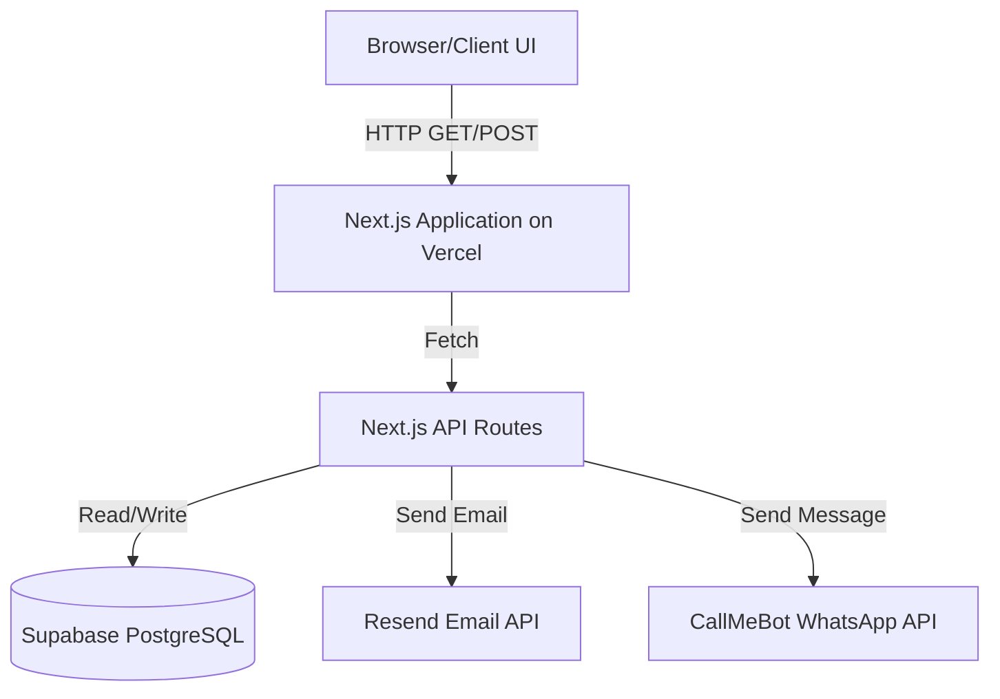
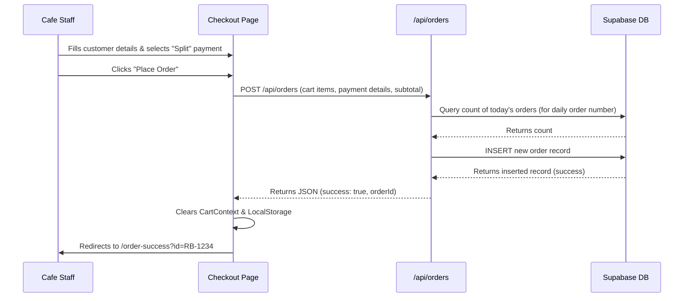
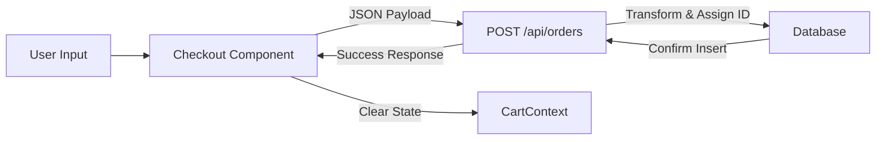

# Taste N' RoLLs - Complete Project Documentation

This document serves as the complete, comprehensive technical documentation for the Taste N' RoLLs (Rollbox) application.

---

## 1. Project Overview

**What problem does this project solve?**
Taste N' RoLLs is a digital ordering and billing system tailored for a fast-food cafe in Sampla. It solves the problem of manual order taking, calculation errors, and lost paper bills by digitizing the entire process from menu browsing to checkout, order recording, and daily/monthly reporting.

**Why was it built?**
It was built to modernize cafe operations, track sales accurately, handle split payments (Cash + UPI), and automatically generate sales reports without relying on third-party POS systems that charge high fees.

**Who are the users?**
- **Cafe Staff/Owners:** They use it as a Point of Sale (POS) system to punch in orders, manage the cart, and view daily sales dashboards.
- **Customers:** Though primarily operated by staff at the counter, the UI is clean enough that it could function as a customer-facing kiosk for viewing the menu and items.

**Main objectives**
- Streamline the order-taking and billing process.
- Support complex payment flows like Split payments (Cash + UPI) and Unpaid (credit) tabs.
- Provide a clear dashboard for revenue tracking.
- Automate daily reports via email (Resend) and WhatsApp (CallMeBot).

**Real-world use case**
A customer walks into Taste N' RoLLs, orders 2 Paneer Rolls and a Mint Mojito. The cashier quickly adds these to the digital cart, applies a discount if needed, selects "UPI" or "Split" payment, and finalizes the order. The system records the transaction in the database and assigns a daily order number.

---

## 2. Tech Stack

| Category | Technology | Purpose |
| --- | --- | --- |
| **Language** | JavaScript (ES6+) | Core programming language used across the stack. |
| **Framework** | Next.js 14/15 (App Router) | Full-stack React framework handling both frontend UI and backend API routes. |
| **UI Library** | React 19 | Building reusable frontend components and state management. |
| **Database** | Supabase (PostgreSQL) | Serverless relational database for storing orders, payments, and statuses. |
| **Styling** | Vanilla CSS (`globals.css`) | Custom styling utilizing CSS variables for theming (dark/light mode). |
| **State Management** | React Context API | Managing global state for Cart (`CartContext`) and Theme (`ThemeContext`). |
| **Package Manager** | npm | Managing project dependencies. |
| **Deployment** | Vercel | Hosting the application and executing serverless API routes/cron jobs. |
| **External Services** | Resend | Sending automated daily/monthly email reports. |
| **External Services** | CallMeBot | Sending automated WhatsApp messages for daily reports. |
| **Font** | Geist (next/font) | Optimized font loading for better UI aesthetics. |

---

## 3. High-Level Architecture

This project utilizes a **Monolithic Serverless Architecture** based on the Next.js App Router paradigm.

- **Frontend (Client Components):** React components (marked with `"use client"`) handle UI interactivity, context (Cart/Theme), and localStorage persistence.
- **Backend (API Routes):** Next.js Route Handlers (`app/api/*`) act as the backend server, processing requests and interfacing directly with the database.
- **Database Layer:** Supabase provides the PostgreSQL database. The app uses the `@supabase/supabase-js` client to perform CRUD operations.
- **Background Jobs:** Vercel Cron triggers specific API routes (`/api/cron/daily-report`) to run automated tasks on a schedule.

**Why this architecture fits:**
For a single-location cafe POS, a serverless monolithic Next.js app provides incredibly fast development velocity, zero server maintenance overhead, and seamless integration between the UI and API layers.



---

## 4. Folder Structure

```text
/rollbox-app
├── app/
│   ├── api/          # Backend Next.js API Route Handlers
│   │   ├── auth/     # Simple password validation endpoint
│   │   ├── cron/     # Automated background jobs (daily/monthly reports)
│   │   ├── dashboard/# Sales and stats fetching logic
│   │   ├── orders/   # CRUD operations for customer orders
│   │   └── report/   # Report generation endpoints
│   ├── bill/         # Dynamic route [id] for displaying order receipt
│   ├── cart/         # Cart review and management page
│   ├── checkout/     # Finalize order and payment selection
│   ├── components/   # Reusable UI components (Navbar, Footer, Toast, etc.)
│   ├── context/      # React Context providers (Cart, Theme)
│   ├── dashboard/    # Admin dashboard UI page
│   ├── data/         # Static data (e.g., menu.js with categories and items)
│   ├── history/      # Order history UI page
│   ├── lib/          # Helper libraries (e.g., supabase client initializer)
│   ├── menu/         # Menu browsing UI page
│   ├── order-success/# Confirmation page after successful checkout
│   ├── unpaid/       # UI page dedicated to unpaid/credit orders
│   ├── layout.js     # Root layout wrapping the app with Contexts
│   ├── page.js       # Hero/Landing page
│   └── globals.css   # Global styles and CSS variables
├── public/           # Static assets (images, icons)
├── .env.local        # Environment variables (Supabase keys, API keys)
├── next.config.mjs   # Next.js configuration
├── package.json      # Dependencies and scripts
└── vercel.json       # Vercel deployment & cron configuration
```

---

## 5. Complete Request Flow

Example: Placing an Order



---

## 6. Component-by-Component Explanation

### CartContext (`app/context/CartContext.js`)
- **Purpose:** Global state for shopping cart and toasts.
- **Responsibilities:** Adding/removing items, changing quantity, calculating subtotals/discounts/totals, syncing with `localStorage`.
- **Outputs:** Exposes `cart`, `totalItems`, `totalPrice`, `addToCart()`, `clearCart()`, etc.

### ThemeContext (`app/context/ThemeContext.js`)
- **Purpose:** Manages light/dark mode.
- **Responsibilities:** Toggles a `data-theme` attribute on the `<html>` root element and saves preference to `localStorage`.

### MenuItem (`app/components/MenuItem.js`)
- **Purpose:** Displays a single food item card.
- **Responsibilities:** Renders item details, handles quantity controls, and opens modal popups for complex items (like Pizza) to select sizes and add-ons before dispatching to CartContext.

### FloatingCart (`app/components/FloatingCart.js`)
- **Purpose:** Persistent floating button showing cart status.
- **Responsibilities:** Displays total item count and price, allows quick navigation to the `/cart` page from anywhere.

### menu.js (`app/data/menu.js`)
- **Purpose:** Centralized repository for the entire cafe menu.
- **Responsibilities:** Defines categories, items, prices (half/full, regular/medium/large), add-ons, and the accordion structure. It acts as the single source of truth, meaning no DB hits are required just to load the menu.

---

## 7. Database Design

The application relies primarily on a single comprehensive `orders` table in Supabase.

### Table: `orders`
- `id` (UUID, Primary Key) - Auto-generated by Supabase.
- `created_at` (Timestamptz) - Order timestamp.
- `order_id` (Text, Unique) - Human-readable unique ID (e.g., `RB-L8X9YZ`).
- `daily_order_number` (Int) - Sequential order number resetting daily.
- `customer_name` (Text) - Name of the customer.
- `customer_phone` (Text) - Optional phone number.
- `items` (JSONB) - Array of objects containing cart items (id, name, variant, qty, price).
- `subtotal` (Float) - Amount before discounts.
- `discount_applied` (Boolean) - Whether a discount was used.
- `discount_percent` (Float) - Discount percentage (0-100).
- `discount_amount` (Float) - Absolute discount subtracted.
- `total_amount` (Float) - Final amount payable.
- `payment_method` (Text) - Cash, UPI, Split, or Unpaid.
- `status` (Text) - `completed` or `unpaid`.
- `cash_amount` (Float) - Amount received in cash (useful for Split).
- `upi_amount` (Float) - Amount received in UPI (useful for Split).

**Why this design?**
Storing `items` as JSONB is a deliberate NoSQL-like approach within PostgreSQL. It avoids complex joins for every receipt and locks in the price and name of the item at the exact moment of sale (preventing historical data corruption if menu prices change later).

---

## 8. Authentication & Authorization

The app uses a very lightweight, custom authentication mechanism tailored for a single-terminal physical cafe.

- **Login Flow:** The `/dashboard` and `/history` pages are protected by a simple passcode. The user enters a password on the frontend, which is verified against `DASHBOARD_PASSWORD` via POST `/api/auth`.
- **Database Auth (Supabase):** 
  - `createBrowserClient()`: Uses Anon Key.
  - `createServerClient()`: Uses Service Role Key (bypassing Row Level Security). All data writing and reading is safely proxied through Next.js API routes, which act as a secure backend.

```mermaid
sequenceDiagram
    participant Admin
    participant Dashboard UI
    participant /api/auth
    Admin->>Dashboard UI: Enters PIN "1234"
    Dashboard UI->>/api/auth: POST {password: "1234"}
    /api/auth->>/api/auth: Compare with env.DASHBOARD_PASSWORD
    /api/auth-->>Dashboard UI: {success: true}
    Dashboard UI->>Admin: Grants access to dashboard features
```

---

## 9. API Documentation

### 1. `POST /api/orders`
- **Purpose:** Create a new order.
- **Body:** `{ customer: {name, phone}, items: [...], total, paymentMethod, subtotal, discountPercent, ... }`
- **Logic:** Calculates `daily_order_number` by counting existing orders for today. Inserts record to `orders` table.

### 2. `GET /api/orders?id=<orderId>&status=<status>`
- **Purpose:** Fetch a single order by ID or list all orders by status (e.g., unpaid).

### 3. `PATCH /api/orders`
- **Purpose:** Update an existing order (used for editing unpaid tabs or changing payment methods).
- **Body:** `{ orderId, items, total, status, ... }`

### 4. `GET /api/dashboard?startDate=<date>&endDate=<date>`
- **Purpose:** Fetches aggregation data for the admin dashboard.
- **Response:** Sales counts, revenue, unpaid totals, and filtered orders list.

### 5. `GET /api/cron/daily-report`
- **Purpose:** Generates a daily textual report and sends it via Email and WhatsApp.
- **Authentication:** Requires `CRON_SECRET` Bearer token (Vercel Cron).

---

## 10. Frontend Architecture

The frontend follows a component-based architecture using React Server & Client Components.

- **State Management:** React Context (`CartContext`) holds volatile state. `localStorage` is used for persistence so the cart isn't lost on refresh.
- **Routing:** Handled by Next.js App Router (file-system based routing in the `/app` directory).
- **Pages:**
  - `page.js`: Attractive landing page with floating animations.
  - `menu/page.js`: Accordion-based menu categorized logically.
  - `cart/page.js`: Review cart, apply percentage discounts.
  - `checkout/page.js`: Form for customer details and complex payment logic (Split payments enforcing Cash + UPI = Total).
- **Rendering Flow:** Mostly Client Components (`"use client"`) due to heavy interactivity (cart manipulation, local storage, form states).

---

## 11. Backend Architecture

The backend is composed of serverless functions hosted on Vercel (Next.js Route Handlers).

- **Controllers:** The functions exported as `GET`, `POST`, `PATCH` inside `app/api/*/route.js`.
- **Services/Repositories:** Database interactions are tightly coupled within the controllers using `@supabase/supabase-js`. `lib/supabase.js` provides initialized client instances.
- **Error Handling:** Try-catch blocks wrap API logic, returning HTTP 500 JSON responses on failure. Supabase errors are console-logged for Vercel logs debugging.

---

## 12. File-by-File Explanation

- **`app/layout.js`**: The root layout. Wraps all children in `ThemeProvider` and `CartProvider`. Includes Navbar, Footer, and FloatingCart globally.
- **`app/page.js`**: The Home hero section. Generates animated food emojis and particles. Shows quick stats (Total items, cart count).
- **`app/checkout/page.js`**: The core payment logic file. Allows user to select Cash, UPI, Unpaid, or Split. If Split, enforces that cash + upi inputs exactly match the total price. Dispatches to API.
- **`app/api/orders/route.js`**: The main CRUD endpoint for orders. Handles the generation of the sequential daily order number.
- **`app/data/menu.js`**: The hardcoded menu database. Exports `menuData`, `pizzaAddOns`, `generalAddOns`, and `accordionMenu`. Eliminates need for a menu DB table.
- **`app/api/cron/daily-report/route.js`**: Calculates daily aggregations grouped by food category (using icon mapping) and triggers external APIs (Resend, CallMeBot) to dispatch the text.
- **`.env.local`**: Holds secret keys for Supabase, Resend, and CallMeBot. (Note: Only `NEXT_PUBLIC_` variables are exposed to the browser).

---

## 13. Function-by-Function Explanation

### `generateReport(orders, dateLabel)` (in `api/cron/daily-report/route.js`)
- **Purpose:** Parses raw order objects into a readable text format.
- **Algorithm:**
  1. Filters orders by payment method to sum Cash vs UPI.
  2. Creates a `sectionMap` dictionary.
  3. Iterates over every item in every order. Maps the item ID to its category using `buildItemCategoryMap()`.
  4. Accumulates quantities and revenues per category and per item.
  5. Sorts categories by total quantity sold descending.
  6. Formats data into a structured string with emojis.
- **Time Complexity:** O(N * M) where N is orders and M is items per order. Fast enough for daily cafe volumes.

---

## 14. Execution Flow

1. **Application Startup:** User opens `localhost:3000`.
2. **Context Initialization:** `CartContext` reads from `localStorage` to restore previous session.
3. **Menu Browsing:** User navigates to `/menu`. Data is loaded statically from `menu.js`.
4. **Cart Operation:** User adds items; `CartContext` state updates, triggering re-renders in `FloatingCart` and `Navbar`.
5. **Checkout Validation:** On `/checkout`, form state tracks customer name and split amounts.
6. **API Request:** Submitting fires `POST /api/orders`.
7. **Database Persistence:** API connects to Supabase, calculates daily ID, and inserts JSON.
8. **Completion:** UI redirects to `/order-success` and clears the cart context.

---

## 15. Data Flow



---

## 16. Business Logic

**Feature: Split Payments**
- **Purpose:** Often customers pay part in cash and part via UPI.
- **Flow:** Handled entirely in frontend `checkout/page.js`. If "Split" is selected, two input fields appear. Typing in one auto-calculates the remainder for the other field. On submit, validation ensures `Cash + UPI === Total`. Both amounts are saved explicitly in the database schema.

**Feature: Daily Reports**
- **Purpose:** Automate the end-of-day tally for owners.
- **Flow:** Vercel Cron hits `/api/cron/daily-report` at 11 PM IST. It fetches all orders for the current day. It parses the JSON arrays of items, groups them by food category, calculates totals, and dispatches via API to WhatsApp/Email.

---

## 17. Important Algorithms

**Daily Order Number Calculation (`api/orders/route.js`)**
- To reset order numbers daily (e.g., #1, #2, #3), the API queries Supabase for a `count` of all orders where `created_at` falls between `00:00:00` and `23:59:59` of the current day in IST timezone. The new order number is assigned as `count + 1`.

---

## 18. Security Analysis

- **Authentication:** Basic PIN auth is used for the dashboard. This is low security but acceptable for a physical kiosk.
- **Database Security:** Supabase Service Role Key is used on the server, meaning the Next.js API Routes are the only barrier. RLS (Row Level Security) is largely bypassed since the backend acts as a trusted entity.
- **Environment Variables:** Secrets (Resend, Supabase Service Key) are safely kept in `.env.local` and not leaked to the client bundle.
- **Vulnerability:** The PIN auth is susceptible to brute force attacks. Rate limiting is missing.
- **Cron Security:** Cron routes verify a `CRON_SECRET` authorization header to prevent public triggering of emails/messages.

---

## 19. Error Handling

- **API Layer:** Every API route is wrapped in `try { ... } catch (err) { ... }`. Errors are logged to the server console (Vercel Logs) and generic `500 Internal Server Error` JSON is returned to the client to avoid leaking stack traces.
- **Frontend Layer:** `alert()` is heavily used for user-facing errors (e.g., "Missing customer name", "Amounts don't match"). `try-catch` wraps `fetch` calls, showing fallback alerts if the network fails.

---

## 20. Performance Optimizations

- **Static Menu Data:** The entire menu is a static JS file (`data/menu.js`). No database queries are required to render the menu, making the UI instantaneous.
- **Next/Font:** `Geist` font is automatically optimized and self-hosted via `next/font`.
- **LocalStorage:** Cart state is synchronized with localStorage, avoiding server hits for session management.

---

## 21. Design Patterns

- **Context API (State Pattern):** Global state for Cart and Theme avoids extreme prop drilling.
- **Monolith / Serverless Pattern:** Combining frontend and backend in one Next.js repository speeds up development.
- **NoSQL in SQL:** Utilizing JSONB for `items` in the orders table simplifies the schema, acting as an **Aggregate** pattern where an Order and its Items are treated as a single data entity.

---

## 22. External Integrations

1. **Supabase:** Core database. Connects via `@supabase/supabase-js`. Handles structured storage.
2. **Resend:** Email API used in daily cron jobs to send formatted HTML reports to the cafe owner.
3. **CallMeBot:** A WhatsApp API gateway. Used to forward the plain-text daily report directly to the owner's WhatsApp number.

*(Note: `razorpay` and `pdfkit` are present in `package.json` but appear to be unused/legacy dependencies not utilized in the core payment or reporting flows).*

---

## 23. Deployment

- **Hosting:** Deployed on Vercel.
- **Environment Variables:** Configured in Vercel dashboard.
- **Cron Jobs:** Scheduled via `vercel.json`:
  ```json
  {
    "crons": [
      { "path": "/api/cron/daily-report", "schedule": "30 17 * * *" }
    ]
  }
  ```
  *(Note: 17:30 UTC is 11:00 PM IST).*

---

## 24. Configuration Files

- **`package.json`:** Defines scripts (`next dev`, `build`) and tracks dependencies.
- **`next.config.mjs`:** Contains `serverExternalPackages: ["pdfkit"]`. (Indicates PDFKit was considered for server-side generation).
- **`vercel.json`:** Defines Cron schedules for automated Vercel functions.
- **`.gitignore`:** Ignores `.env`, `node_modules`, and `.next` build folders.

---

## 25. Dependencies

- **`next`, `react`, `react-dom`:** Core framework. Essential.
- **`@supabase/supabase-js`:** DB Client. Essential.
- **`razorpay`:** Payment gateway SDK. **Unused / Replaceable**. The current flow handles payments manually (Cash/UPI QR).
- **`pdfkit`:** PDF generation library. **Unused / Replaceable**. Reports are currently generated as HTML/Text.

---

## 26. Code Walkthrough

"Imagine a customer orders a Veg Roll. In the UI, the staff clicks the item in `MenuItem.js`. This triggers `addToCart` from `CartContext`, which updates React state and saves to `localStorage`. The staff clicks the Floating Cart, goes to `/cart`, and proceeds to `/checkout`.
In `checkout/page.js`, they enter 'Rahul', select 'UPI', and hit submit. The browser sends a POST request with the cart JSON to `/api/orders`. The API creates a Supabase client, counts today's existing orders, and inserts a new row. The UI receives success, clears the local cart, and redirects to the success page displaying the order ID!"

---

## 27. Instructor/Viva Explanation

### How to Explain This Project to an Instructor

**2-Minute Explanation:**
"This is a full-stack Point of Sale (POS) application built for a fast-food cafe using Next.js and Supabase. It allows cafe staff to digitize order taking, handle complex split payments (Cash + UPI), and track unpaid tabs. At the end of the day, an automated cron job aggregates sales data and sends a detailed report via WhatsApp and Email. It uses a serverless architecture deployed on Vercel."

**5-Minute Explanation:**
Add to the above: "The frontend is highly optimized by keeping the entire menu as a static JavaScript object, meaning zero database latency when browsing. State is managed via React Context. For the database, I chose PostgreSQL via Supabase but utilized the `JSONB` column type for order items. This hybrid relational/NoSQL approach means an order and its items are stored in a single row, perfectly preserving historical item prices and preventing complex JOINs. Payment logic handles edge cases like splitting exact amounts between Cash and UPI."

**10-Minute Technical Explanation:**
Discuss the API Routes, the difference between Server and Client Supabase instances (Service Role vs Anon keys), and the logic behind the Daily Report Cron job. Explain how the `vercel.json` cron hits the Next.js API, parses the JSON arrays of every order for the day, maps item IDs back to categories using the static menu data, sorts them by volume, formats it, and dispatches HTTP requests to Resend and CallMeBot.

---

## 28. Interview Questions

**Easy: Why did you choose Next.js for this project?**
*Answer:* Next.js provides a unified full-stack environment. I didn't have to manage a separate Node/Express backend and React frontend. The API routes seamlessly connect to Supabase, and App Router simplifies file-based routing.

**Medium: How do you handle complex payment scenarios like Split payments?**
*Answer:* In the Checkout component, selecting "Split" opens two controlled input fields. I implemented a dynamic auto-calculation: if you type an amount in "Cash", it deducts that from the total and auto-fills "UPI", ensuring the sum always exactly equals the total order value before allowing submission.

**Hard: How did you design the database schema for order items, and what are the trade-offs?**
*Answer:* Instead of creating an `order_items` table with foreign keys to `orders` and `menu`, I stored items as an array of objects in a `JSONB` column inside the `orders` table.
*Trade-off:* It breaks First Normal Form (1NF), making complex SQL analytics on specific items harder. *However*, it perfectly snapshots the price and name of the item at the time of purchase, and drastically speeds up read/write operations by avoiding JOINs, which is ideal for a receipt-based system.

---

## 29. Improvements

- **Code Improvements:** Implement TypeScript for better type safety, especially for the `items` JSON structure.
- **Security Improvements:** Replace the simple PIN auth with actual JWT-based authentication using Supabase Auth. Implement rate limiting on API routes.
- **Architecture Improvements:** Clean up unused dependencies (`razorpay`, `pdfkit`).
- **Performance:** Move some Client Components to Server Components where interactivity isn't strictly needed.
- **Maintainability:** Extract hardcoded API URLs and secrets into centralized constants.

---

## 30. Key Takeaways

The Taste N' RoLLs application successfully demonstrates how modern web technologies (Next.js, Serverless, Supabase) can be used to build a robust, low-latency, and cost-effective POS system for small businesses.

**Strengths:** Extremely fast UI due to static menu data, flexible payment handling (Split/Unpaid), and excellent automated daily reporting.
**Weaknesses:** Security is basic (PIN code), and the codebase contains some unused dependencies.
**Overall:** A highly functional, real-world utility application that elegantly bridges physical cafe operations with modern digital tracking.
